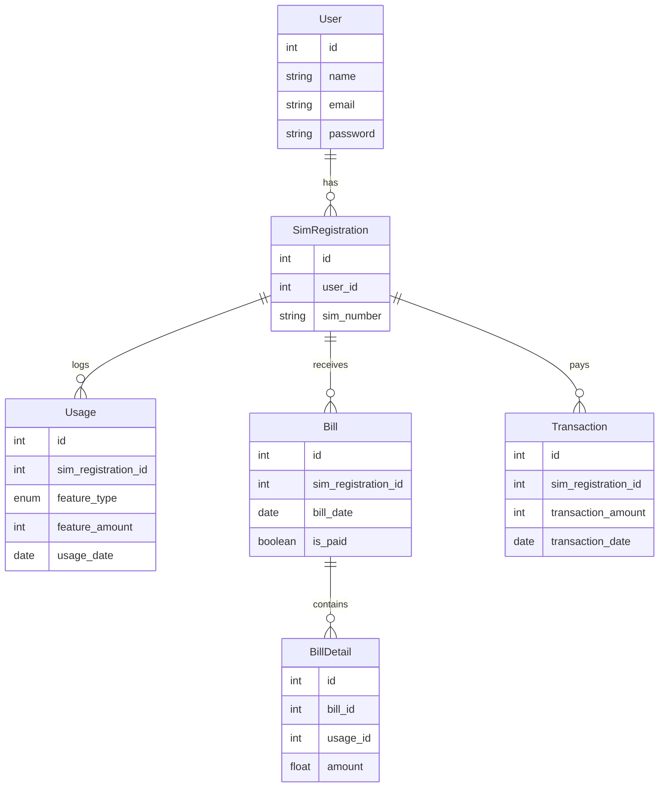

# 📦 XellPay Billing API

This repository contains the source code for the **XellPay Billing System**, a Laravel-based API that allows subscriber registration, usage tracking, bill calculation, and payment management.

---

## 🔗 Source Code

📁 **GitHub Repo**: [https://github.com/AtaAksoy/xellpay](https://github.com/AtaAksoy/xellpay)

---

## 📚 API Documentation

You can access the full Swagger-generated API documentation here:

🔗 [https://xellpay-main-pbcmwd.laravel.cloud/api/documentation](https://xellpay-main-pbcmwd.laravel.cloud/api/documentation)

## 🎨 Design, Assumptions & Issues

### ✅ Design Overview

- **Backend**: Laravel 11+ PHP 8.4
- **Authentication**: JWT (Bearer Token)
- **Billing Rules**:
  - **Calls**: First 1000 minutes free, $10 per 1000 minutes after
  - **Internet**: First 20GB = $50, every extra 10GB = $10
- **Data Flow**:
  1. Subscriber registers and authenticates
  2. Usage (CALL, INTERNET, SMS) is recorded monthly
  3. Bill is calculated for a month using aggregated usage
  4. Bill can be paid fully or partially

### ⚙️ Assumptions

- One active SIM registration per subscriber.
- Usage is scoped monthly.
- Only one bill per subscriber per month.
- All transactions are scoped by bill date.

### 🐛 Issues Encountered

- PHP attribute-based OpenAPI annotations required careful nesting.
- Handling of partial payments using transaction logs without duplicating state.
- Complex DTO mapping and Eloquent relationship logic.

---

## 🗃️ Data Model (ER Diagram)



---

## 🎥 Project Demo Video

▶️ **Watch the demo**: [Google Drive Link](https://drive.google.com/file/d/YOUR_VIDEO_ID/view)

---

## 🚀 Getting Started

Clone the repo:

```bash
git clone https://github.com/AtaAksoy/xellpay.git
cd xellpay
```

Install dependencies:

```bash
composer install
cp .env.example .env
php artisan key:generate
php artisan migrate
```

Run the server:

```bash
php artisan serve
```

---

## 📄 License

This project is open-sourced under the [MIT license](LICENSE).